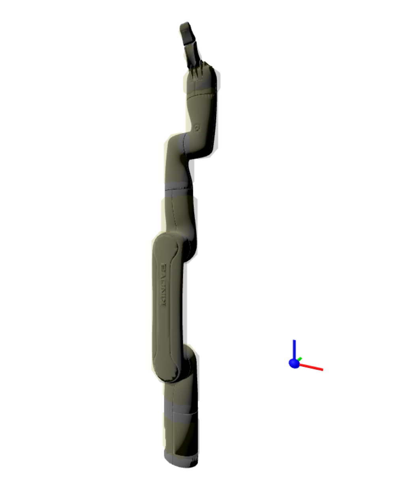

# `robot-loader` 用の Kinova Robot の作成

以下の手順には、ROS2、blender3.6、meshlab/meshlabserver、および Node.js が必要です。<br>
ROS2 をインストールするには、公式の ROS2 インストールガイドを参照してください:
https://docs.ros.org/en/jazzy/Installation/Ubuntu-Install-Debs.html
```bash
sudo apt update
sudo apt install ros-dev-tools
sudo apt install ros-jazzy-desktop-full
sudo apt install ros-jazzy-urdf-tutorial
```
以下の手順で使用される blender スクリプトは、ver.4 では正しく動作しない可能性があります。<br>
ver.3.6 をインストールしてください。<br>
そして、必要に応じて環境変数 `BLENDER` を blender 実行可能ファイルへのパスに設定してください。<br>
例えば、
```bash
export BLENDER=~/blender/blender
```
blender をインストールするには、公式ウェブサイトを参照してください。:
https://www.blender.org/download/lts/3-6/

Meshlab と meshlabserver は apt を使用してインストールできます。:
```bash
sudo apt install meshlab
```

## robot-loader および ik-worker で使用されるジョイント情報とリンクの可視化情報の作成

このセクションでは、Kinova Robotics ロボットを `robot-loader` および `ik-worker` で使用するために必要な `urdf.json`、`linkmap.json`、`update.json` ファイル、およびメッシュファイルの作成方法について説明します。

0. ros2 ワークスペースがない場合は作成します。**上書きは不可です。**
   ```bash
   mkdir -p ~/ros2_kortex_ws/src
   cd ~/ros2_kortex_ws
   colcon build
   ```

1. Kinova git リポジトリを ros2 ワークスペースの `src` フォルダにクローンします。
   ```bash
   cd ~/ros2_kortex_ws/src
   git clone -b jazzy https://github.com/Kinovarobotics/ros2_kortex.git kinova-ros
   apt-get update
   rosdep update
   rosdep install --ignore-src --from-paths src -y -r
   cd ..
   ```

2. ros2 ワークスペースをビルドします。
   ```bash
   source /opt/ros/jazzy/setup.bash
   colcon build --cmake-args -DCMAKE_BUILD_TYPE=Release --parallel-workers 3
   source install/setup.bash
   ```

3. `display.launch.py` を起動して Kinova ロボットの設定を確認します (オプション)。
   ```bash
   ros2 launch urdf_tutorial display.launch.py model:=$PWD/src/kinova-ros/kortex_description/robots/gen3_lite.urdf
   ```
   Joint State Publisher を使用して RViz 内でロボットを動かすことができます。<br>
   ロボットのジョイントのゼロ位置と各ジョイントの動きの方向を確認することをお勧めします。

4. xacro を使用して ROS URDF ファイルを作成します。
   ```bash
   xacro `ros2 pkg prefix kortex_description`/share/kortex_description/robots/kinova.urdf.xacro name:=kinova arm:=gen3_lite dof:=6 gripper:=gen3_lite_2f > gen3_lite_robot.urdf
   ```

5. この作業ディレクトリに戻り、まだの場合はスクリプトの[リポジトリ](https://github.com/ymucystk/Gen3-Lite-example)をクローンします。<br>
   **※ 前ステップで生成した ROS URDF ファイルをこの作業ディレクトリにコピーします。**
   ```bash
   mv ./gen3_lite_robot.urdf <this_working_directory>
   ```
   ```bash
   cd <this_working_directory>
   rm -rf gjk_worker
   rm -rf robot-assets
   ```
   ```bash
   chmod u+x clone.sh
   ./clone.sh
   pnpm i yargs
   ```

6. `splitUrdfTree.sh` スクリプトを使用して、URDF ツリーを個別のチェーンに分割します。
   ```bash
   ./a/splitUrdfTree.sh gen3_lite_robot.urdf
   ```

7. 対応する `chain_X.json`(概要) ファイルを調べて、必要な `chain_X.urdf` ファイルを選択します。<br>
   `ls -l chain_*.json` を使用して各チェーンファイルのサイズを確認し、`view chain_X.json` で最長のチェーンの詳細を確認します。<br>
   通常、最長のチェーンが主要なロボットボディに対応します。<br>
   必要なルートリンクとエンドエフェクタリンクが含まれている場合は、それを選択します。

8. 選択した `chain_X.urdf` ファイルから、`extract-joint-and-link-tag.sh` を使用して、
   ジョイントマップファイル (`urdf.json`)、リンクマップファイル (`links.json`)、およびモディファイアファイル (`update.json`) を生成します。<br>
   例えば、`chain_1.urdf` が選択された場合は、以下を実行します。
   ```bash
   ./a/extract-joint-and-link-tag.sh chain_1.urdf
   ```
   これにより、`urdfmap.json` (または `urdfsorted.json`)、`linkmap.json`、および `update-stub.json` ファイルが生成されます。

9. `./a/cut-joint-map.sh` スクリプトを使用して、`urdfmap.json` からジョイントマップの不要な部分を切り取ります。
   ```bash
   ./a/cut-joint-map.sh urdfmap.json --from base_link --to right_finger_dist_link
   ```
   `--from` および `--to` オプションは、選択されたチェーンのルート **LINK** とエンドエフェクタ **link** を指定します。<br>
   これにより `urdfmap_cut.json` ファイルが生成されます

10. 切り取られたジョイントマップファイル (`urdf.json`)を使用してリンクマップファイル (`links.json`)を再生成します。<br>
   例えば、`chain_1.urdf` が選択された場合は、以下を実行します。
   ```bash
   ./a/extract-joint-and-link-tag.sh chain_1.urdf -j urdfmap_cut.json
   ```
   これは厳密には必要ではありませんが、より小さな `linkmap.json` および `update-stub.json` ファイルが生成され、`update-stub.json` ファイルの編集が容易になります。<br>
   コライダーの形状を可視化しない場合は、`-n` オプションを使用できます。

11. リンクマップファイル (`links.json`)から可視化と衝突に必要な形状データを見つけます。
    ```bash
    Meshes=(`grep filename linkmap.json |sed 's/^\s*//'| sed -e 's/^[^:]*:\s*//' -e 's/"//g' -e 's/,//'|sort -u |grep -v collision`);for path in "${Meshes[@]}"; do echo $path; done
    ```
    これにより、選択されたチェーンで使用されているすべてのメッシュファイルの ROS2 パスが一覧表示されます。<br>
    ros2 ワークスペースでロボットのディスクリプションパッケージをビルドしていた場合、パスは `install` フォルダの下で見つけることができます。<br>
    そうでない場合は、通常、ステップ 1 でクローンしたソースツリー内で見つけることができます。

12. メッシュファイルを `meshes` フォルダにシンボリックリンクまたはコピーします。**上書き不可です。**<br>
   クローン直後の状態で既に`meshes` フォルダがある場合は`meshes_org` 等にリネームして退避します。<br>
    例えば、
    ```bash
    mkdir -p meshes
    cd meshes
    ```
    <!--`CONVUM_SGE-M5-N-body-m.bbox` `CONVUM_SGE-M5-N-suction-m.bbox` `table.ply` `template.mlp` をコピーします。-->
    `table.ply` `template.mlp` を`meshes` フォルダにコピーします。
    ```bash
    cp ../meshes_org/table1000.ply ./table.ply
    cp ../meshes_org/template.mlp ./
    ```
    ```bash
    DSRDir=`ros2 pkg prefix kortex_description`/share/kortex_description
    ```
    以下、コピーを実行します。
    ```bash
    for path in "${Meshes[@]}"; do
      path=`echo $path | sed 's|^file:///home/ymucystk_ucl/ros2_kortex_ws/install/kortex_description/share/kortex_description/||'`
      ln -s $DSRDir/$path .
    done
    ```

13. `convert-to-gltf.sh` ツールを使用してメッシュを glTF 形式に変換します。
    ```bash
    for file in *.STL *.stl *.DAE *.dae; do
      ../a/convert-to-gltf.sh "$file"
    done
    cd ..
    ```
    これにより、`out` フォルダの下に各メッシュファイルの glTF ファイル (`.gltf` および `.bin`) が生成されます。

14. `json-pretty-compact.sh` ツールを使用してコンパクトな `update.json` を作成します。
    ```bash
    ./a/json-pretty-compact.sh update-stub.json -o update.json -c 90
    ```
    そして、必要に応じて `update.json` を編集します。


15. 最後に、`urdfmap_cut.json` を `urdf.json` に名前変更し、`urdf.json`、`linkmap.json`、`update.json`、および `meshes/out/` フォルダ内のファイルを `public/gen3_lite/` フォルダまたは他の任意の希望のフォルダに移動します。<br>
    ```bash
    mkdir -p ./public/gen3_lite
    cp urdfmap_cut.json ./public/gen3_lite/urdf.json
    cp linkmap.json ./public/gen3_lite/linkmap.json
    cp update.json ./public/gen3_lite/update.json
    cp -r meshes/out/*.* ./public/gen3_lite/
    ```
    これで、作成されたファイル (`urdf.json`、`linkmap.json`、`update.json`) および glTF メッシュファイルを `robot-loader` および `ik-worker` とともに使用できます

## コライダー情報とその可視化情報の作成

このセクションでは、`cd-worker` で使用されるコライダーを定義する `shapes.json` ファイルと可視化情報の作成方法について説明します。

`shapes.json` ファイルは、凸形状の頂点とそれらの構成のみを定義します。

`shapes.json` ファイルを作成するには 2 つの方法があります。

1 つはリンクメッシュのバウンディングボックスから作成する方法で、もう 1 つはより複雑で、リンクメッシュをデシメートして凸状のパーツに分解する方法です。

前者の方法については、[`HowToMakeShapes_json_file2.md`(in Japanese)](https://github.com/TSUSAKA-ucl/cd-config-generation/blob/main/docs/HowToMakeShapes_json_file2.md)を参照してください。
後者の方法については、[`HowToMakeShapes_json_file3.md`(in Japanese)](https://github.com/TSUSAKA-ucl/cd-config-generation/blob/main/docs/HowToMakeShapes_json_file3.md)を参照してください。

Kinova Robotics ロボットは単純な形状のリンクを持っているため、通常は前者の方法で十分です。

1. DAE ファイルを使用してバウンディングボックスからコライダーを作成します。
   ```bash
   cd meshes/
   ../s/boundingBox.sh *.STL
   ```
   これにより、各 DAE ファイルの バウンディングボックスファイル(`.bbox`)が作成されます。

2. 必要に応じてバウンディングボックスファイル(`.bbox`)を編集して、よりタイトにします。

3. バウンディングボックスファイル(`.bbox`)からコライダー用のコライダーファイル (STL ファイル、PLY ファイル、glTF ファイル) を作成します。
   ```bash
   ../s/createBboxAll.sh
   ```

4. 生成されたコライダーが許容できるか確認します。**（GUI画面が開くので形状を確認）**<br>
   <!--`meshlab` はコマンドラインから DAE ファイルを直接開く際に問題があるため、プロジェクトファイルを作成して開く必要がある場合があります。
   ```bash
   for dae in *.dae
   do sed -e "s/TEMPLATE/${dae%.*}/g" template.mlp > "${dae%.*}.mlp"
      meshlab "${dae%.*}".mlp
   done
   ```
   -->
   ```bash
   for dae in *.bbox.stl
      do meshlab $dae
   done
   ```
   <!--ROS の可視化が DAE ファイルの代わりに STL ファイルを使用する場合、meshlab のプロジェクトファイルは必要ありません。
   2 つの STL ファイルを直接開くことができます-->

5. すべてのコライダーが許容できる場合は、各リンクのコライダーファイルを一覧表示する `shapeList.json` ファイルを作成します。
   ```bash
   ../s/create_shapelist.sh *.bbox.ply > shapeList.json
   ```

6. `urdf.json` のジョイントの順序に従ってリンクを並べ替えるために `shapeList.json` を編集します。<br>
   さらに、必要に応じて、エンドリンクに固定されたツールとベースプレートのコライダーを追加します。:
   ```json
   [
      [ "table.ply", "base_link.bbox.ply" ],
      [ "shoulder_link.bbox.ply" ],
      [ "arm_link.bbox.ply" ],
      [ "forearm_link.bbox.ply" ],
      [ "lower_wrist_link.bbox.ply" ],
      [ "upper_wrist_link.bbox.ply" ],
      [ "gripper_base_link.bbox.ply" ],
      [ "right_finger_prox_link.bbox.ply" ],
      [ "right_finger_dist_link.bbox.ply" ],
      [  ]
   ]
   ```

7. `shapeList.json` から `shapes.json` ファイルを作成します。
   ```bash
   ../s/ply_loader.js shapeList.json ../linkmap.json
   ```
   これにより `output.json` ファイルが生成されます。以下のコマンドで`shapes.json` に名前を変更します。
   ```bash
   mv output.json shapes.json
   ```
   <!--これで、gen3_lite ロボットのコライダーを定義する `shapes.json` ファイルができました。<br>
   スケールを合わせるため`shapes.json`内の数値を1/1000にします。
   ```
   node ../scale1000.js
   cp shapes-a1000th.json shapes.json
   rm -rf shapes-a1000th.json
   ```-->

8. リンク間の衝突検出をテストするための `testPairs.json` ファイルを作成します。<br>
   どのリンクペアを衝突テストすべきかを自動的に判断するのは難しいため、このファイルは手書きです。<br>
   <!--ただし、多くの 6-DOF シリアルロボットの場合、以下のペアで十分です。:-->
   ```json
   [
      [0,2],[0,3],[0,4],[0,5],[0,6],
      [1,3],[1,4],[1,5],[1,6],
      [2,4],[2,5],[2,6],
      [3,5],[3,6],
      [3,5]
   ]
   ```

9. 最後に、`shapes.json` と `testPairs.json` を `public/gen3_lite/` フォルダまたは他の任意の希望のフォルダに移動します。<br>
    ```bash
    cp ./shapes.json ../public/gen3_lite/
    cp ../testPairs.json ../public/gen3_lite/
    ```
   これら`shapes.json` と `testPairs.json`は `cd-worker` が必要とするすべてです。<br>
   ただし、`robot-loader` でコライダーを可視化したい場合は、コライダー用の glTF ファイルも必要です。

10. コライダーの STL ファイルからコライダー用の glTF ファイルを作成します。 (`cd meshes/`)
    ```bash
    for file in *.bbox.stl; do
      ../a/convert-to-gltf.sh "$file"
    done
    ```
    STL には色情報がないため、`set-gltf-color.mjs` ツールを使用して glTF ファイルに色と不透明度を追加します。
    ```bash
    cd out
    for f in *.bbox.gltf; do
      node ../../s/set-gltf-color.mjs "$f" --color '#ffff00' --opacity 0.2
    done
    cd ../..
    ```
	`meshes/out/` フォルダで生成された glTF ファイルと bin ファイルを `public/gen3_lite/` フォルダまたは他の任意の希望のフォルダに移動します。
    ```bash
    cp -r meshes/out/*.bbox.* ./public/gen3_lite/
    ```


<!--11. 必要に応じて、ツールのコライダーを描画するために `update.json` を修正します。<br>
      ```
      node ./addToolColliders.js
      ```
	又は<br>
      ```
      node ./addToolColliders.js update.json wrist_3_link CONVUM_SGE-M5-N-body-m.bbox.gltf CONVUM_SGE-M5-N-suction-m.bbox.gltf
      ```
	これらのコマンドは同じ `update_with_tool.json` ファイルを作成し、その後 `json-pretty-compact.sh` ツールを使用してコンパクトな `update.json` を作成（上書き）します。<br>
      ```
      ./a/json-pretty-compact.sh update-with-tools-collider.json -o update.json
      ```

	**注記:**
	ツールは `linkmap.json` で定義されていないため、アタッチされている **LINK の座標系 内** の形状として `shapes.json` および `update.json` に書き込まれます。これは、リンクの **glTF ビジュアルの原点 ではありません**。-->

これで、作成された `shapes.json`、`testPairs.json` ファイル、およびコライダー glTF ファイル (`./meshes/out/*.bbox.gltf`) を `cd-worker` および `robot-loader` とともに使用できます。

ROS ロボットディスクリプションパッケージに可視化用の DAE ファイルが含まれておらず、可視化用に STL ファイルのみが含まれている場合は、前述のように `set-gltf-color.mjs` ツールを使用してコライダー glTF ファイルに色を追加できます。

## メッシュファイルの妥当性確認アプリのインストール

[こちらのリポジトリ](https://github.com/TSUSAKA-ucl/robot-loader-nextjs-example.git) に書いてある手順を実施します。
```bash
pnpm create next-app@latest
cd <project-directory>
```
リポジトリ内の`.npmrc`ファイルを`<project-directory>`にコピーします。<br>
リポジトリ内の`app`フォルダ内の`page.tsx`、`App.tsx`、`globals.css`ファイルを`<project-directory>`の`app`フォルダにコピーします。<br>
コピーした`App.tsx`ファイル内の`ur5e`の記述を`gen3_lite`に変更します。(3か所)<br>
また、`ik-worker`の配列を８個に変更します。<br>
```
ik-worker={`0, 0, 0, 0, 0, 0, 0, 0`}
```
パッケージのインストールをします。(robot-loader@1.1.2, ik-cd-worker@0.4.7 以降)<br>
```bash
pnpm add aframe
pnpm add @ucl-nuee/robot-loader @ucl-nuee/ik-cd-worker
```
アセットコピースクリプトを実行して必要なアセットをパブリックフォルダにコピーします。
```bash
npx copy-assets
```
サーバーを構築して実行します。
```bash
pnpm build
pnpm dev
```


## コライダーの形状調整

任意のテキストエディターで .bbox ファイルを編集します。<br>
Mesh Bounding Box Size の行の値を小さくすると小さくなります。<br>
Mesh Bounding Box crop の行を追加することで、±どちらの方向に小さく(大きく)するかがコントロールできます。<br>
Mesh Bounding Box scale の行を追加することで、面取りの大きさをコントロールできます。<br>
